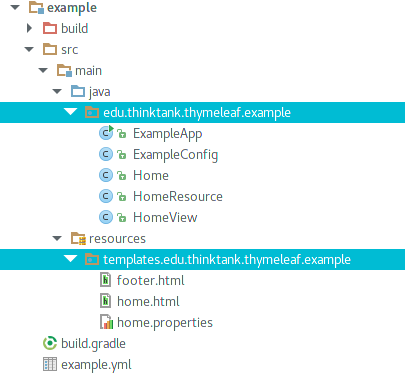

# dropwizard-views-thymeleaf
Thymeleaf 3 for Dropwizard 1.0.0

[](https://travis-ci.org/3ddysan/dropwizard-views-thymeleaf)

Inspired by [deffence1776/dropwizard-views-thymeleaf](https://github.com/deffence1776/dropwizard-views-thymeleaf) and [dropwizard/dropwizard-views-mustache](https://github.com/dropwizard/dropwizard/tree/master/dropwizard-views-mustache)

### example.yml
```yml
views:
  .html:
    cache: false
    prefix: "/templates"
    mode: HTML

```
### Application
```java
public class ExampleApp extends Application<ExampleConfig> {

    @Override
    public void initialize(final Bootstrap<ExampleConfig> bootstrap) {
        bootstrap.addBundle(new ViewBundle<ExampleConfig>(ImmutableList.of(new ThymeleafViewRenderer())) {
            @Override
            public Map<String, Map<String, String>> getViewConfiguration(final ExampleConfig configuration) {
                return configuration.views;
            }
        });
    }

    @Override
    public void run(final ExampleConfig exampleConfig, final Environment environment) {
        environment.jersey().register(new HomeResource());
    }

    public static void main(final String[] args) throws Exception {
        new ExampleApp().run(args);
    }

}

```

Template files must be in same package (+ prefix) as the view class, whenever View name does not start with an "/".

